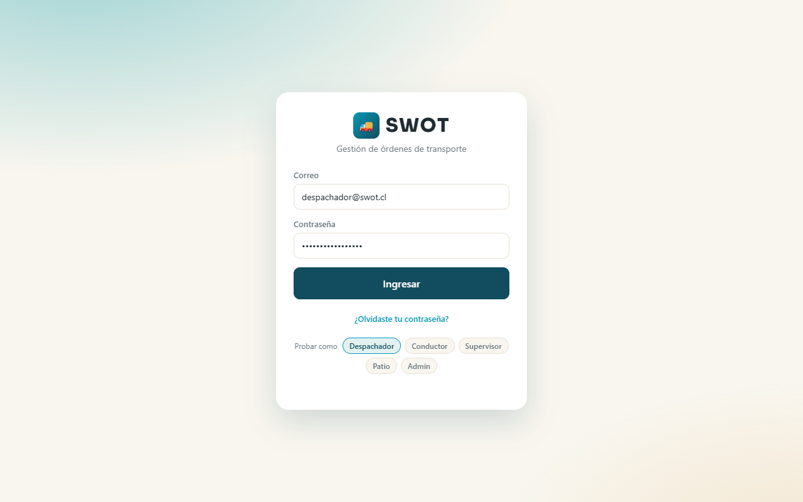
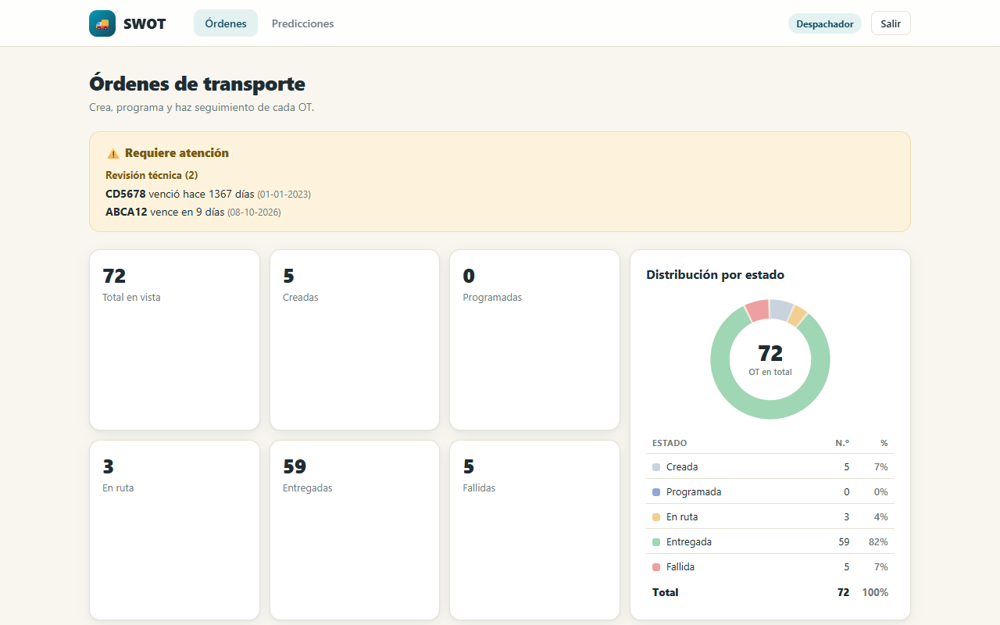
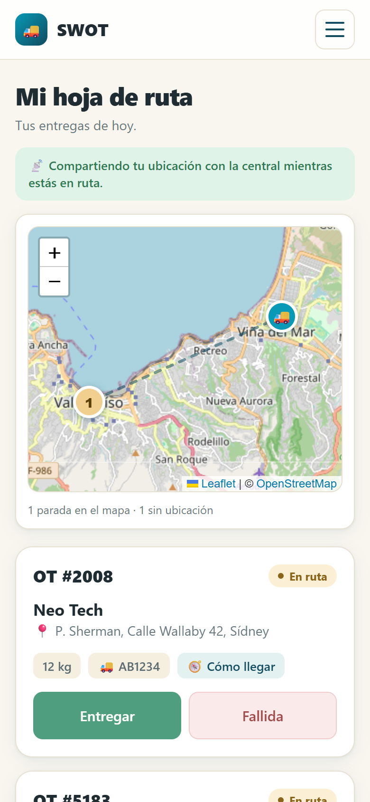
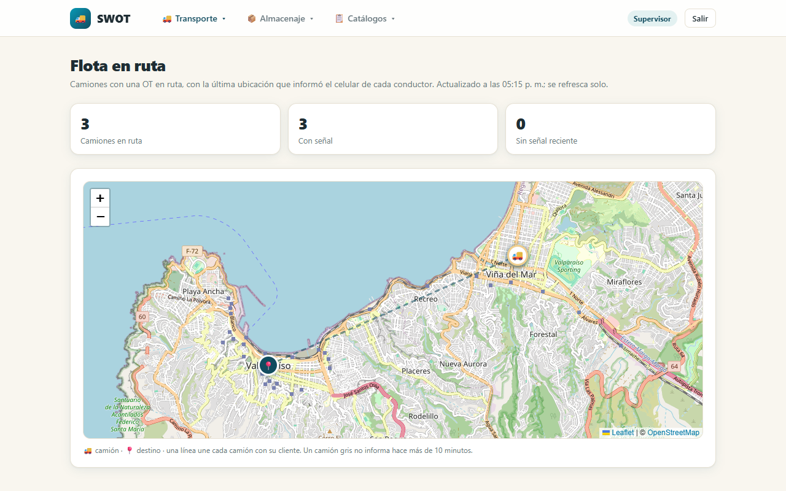
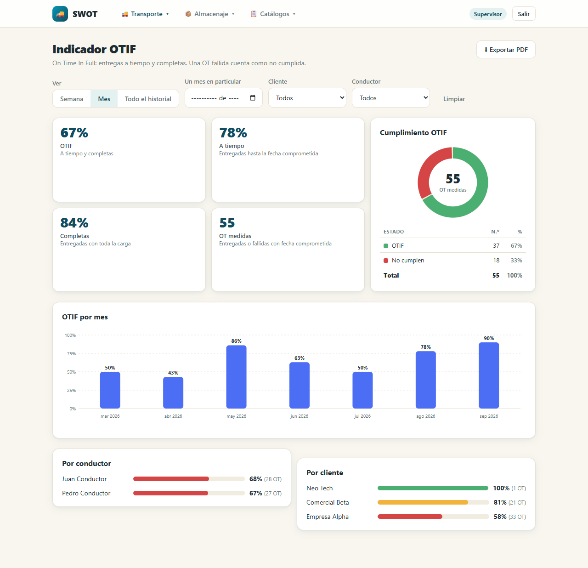
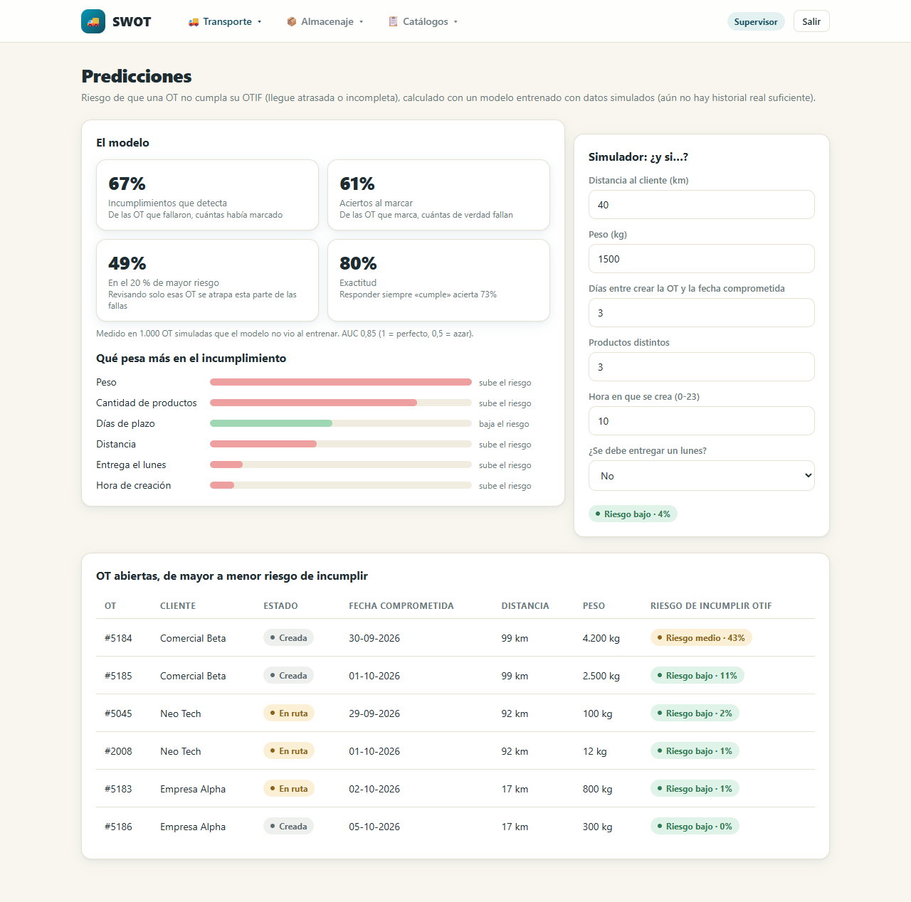
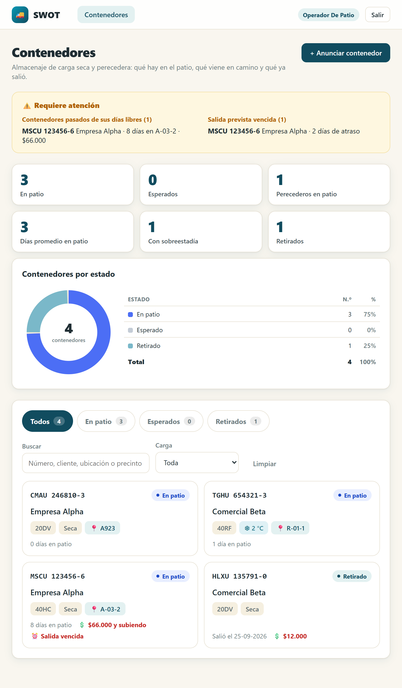
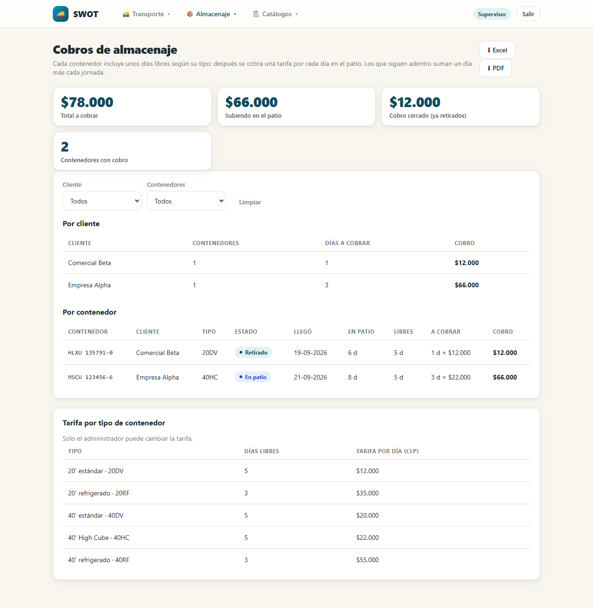
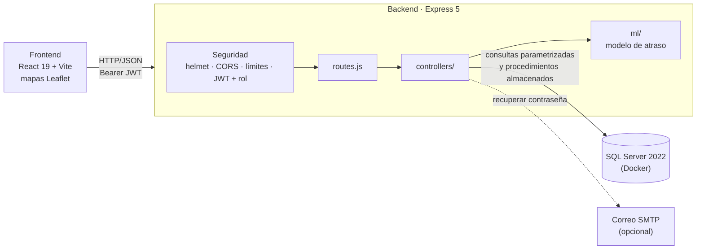

# SWOT · Sistema Web de Órdenes de Transporte

Proyecto de práctica personal (caso ficticio **Neo Tech Logística**, un operador logístico de carga seca y perecedera). Un solo sistema para dos servicios:

- 🚚 **Transporte:** los despachadores planifican órdenes de transporte (OT), los conductores registran cada entrega desde el celular con la foto de la guía firmada, y los supervisores ven los indicadores (OTIF), la flota en el mapa y el riesgo de atraso de cada OT.
- 📦 **Almacenaje de contenedores:** el operador de patio registra cuándo llega cada contenedor, dónde queda, cuándo se mueve y cuándo sale; el sistema **cobra los días que pasan de los días libres** y avisa de los excedidos.

**Stack:** React 19 + Vite · Node.js + Express 5 · SQL Server 2022 (procedimientos almacenados) · JWT · Leaflet/OpenStreetMap · modelo de IA propio en JavaScript

## Contenido

1. [Capturas](#capturas)
2. [Qué puede hacer cada rol](#qué-puede-hacer-cada-rol)
3. [Reglas de negocio](#reglas-de-negocio)
4. [Arquitectura](#arquitectura)
5. [Estructura del repositorio](#estructura-del-repositorio)
6. [Puesta en marcha](#puesta-en-marcha)
7. [Pruebas](#pruebas)
8. [Copias de seguridad](#copias-de-seguridad)
9. [Seguridad](#seguridad)
10. [API](#api)
11. [Si ya tenías una base de datos](#si-ya-tenías-una-base-de-datos)

## Capturas

| | |
|---|---|
|  **Inicio de sesión** con la tarjeta que gira para recuperar la contraseña |  **Órdenes** del despachador, con gráfico por estado y alertas |
|  **Ruta del conductor** en el celular, con el mapa de sus paradas |  **Flota** en ruta para el supervisor |
|  **OTIF** por mes, con filtros por cliente y conductor |  **Predicciones**: riesgo de atraso de cada OT |
|  **Contenedores** como tarjetas grandes para tablet |  **Cobros** de almacenaje y tarifa por tipo |

## Qué puede hacer cada rol

| Rol | Puede |
|---|---|
| **Despachador** | Crear OT (cliente, fecha comprometida, productos), programarlas asignando vehículo y conductor, filtrarlas y exportarlas a Excel o PDF; ver el riesgo de atraso de las OT abiertas |
| **Conductor** | Ver su hoja de ruta con un **mapa de sus próximas paradas** y un enlace "Cómo llegar", iniciar la ruta y registrar la entrega con el **RUT de quien recibe** y la **foto de la guía firmada** (o marcarla como fallida, con confirmación) |
| **Supervisor** | Ver órdenes, clientes, vehículos, conductores y productos (solo lectura), el **mapa de la flota en ruta**, el **OTIF**, las **predicciones**, las alertas, los contenedores y los **cobros** de almacenaje |
| **Administrador** | Lo del supervisor, más crear, editar y desactivar clientes, vehículos, conductores y productos, gestionar los contenedores y **cambiar la tarifa** de almacenaje |
| **Operador de patio** | Anunciar contenedores, registrar su llegada, moverlos de posición y registrar su salida; ver el panel del patio y sus alertas |

Cualquier usuario puede **recuperar su contraseña** desde el inicio de sesión (ver [reglas](#recuperar-la-contraseña)).

## Reglas de negocio

### Transporte

- Flujo de estados: `Creada → Programada → En ruta → Entregada` o `Fallida`. El conductor solo puede avanzar sus propias OT y solo en ese orden.
- No se programa un camión **sin capacidad** para el peso de la OT ni con la **revisión técnica vencida** (error 409).
- El **peso de la OT se calcula** con los productos (cantidad × peso por presentación); solo se escribe a mano cuando algún producto no tiene peso definido.
- Una entrega exige un **RUT válido** (con dígito verificador) y la foto de la guía firmada.
- Los registros se **desactivan**, no se borran, para conservar el historial. Un usuario desactivado pierde el acceso al instante.

### OTIF

**On Time In Full:** porcentaje de OT entregadas a la fecha comprometida o antes **y** completas. Una OT fallida cuenta como no cumplida. Se puede ver **por mes o de todo el historial**, y filtrar por **un mes en particular, rango de fechas, cliente y conductor**. Se exporta a PDF con los filtros aplicados.

### Mapas y flota

- Cada cliente puede tener un **punto de entrega** en el mapa, que el administrador marca con un clic al crear o editar el cliente. Las OT de un cliente sin punto se listan igual, pero no salen en el mapa.
- **Conductor:** ve sus paradas numeradas en el orden de entrega, su propia posición y una línea que las une. Cada tarjeta trae "Cómo llegar" (abre Google Maps).
- **Ubicación del camión:** mientras el conductor tiene una OT **en ruta**, su celular informa dónde está (con permiso del navegador) como máximo cada 30 segundos. Solo se guarda la **última posición**, y se borra apenas termina su última entrega. Nunca se guarda un historial de recorridos.
- **Supervisor y administrador:** la pantalla **Flota** muestra cada camión en ruta, su destino y la señal más reciente; se actualiza sola cada 20 segundos. Un camión sin señal hace más de 10 minutos se ve en gris.
- Los mapas usan [OpenStreetMap](https://www.openstreetmap.org/copyright) (necesitan internet). Los navegadores de celular solo entregan la ubicación en páginas **HTTPS** (o `localhost`), así que para probar en un teléfono real hay que servir el frontend por HTTPS.

### Almacenaje de contenedores

- Flujo: `Esperado → En patio → Retirado`. Cada llegada, movimiento y salida queda en el historial con fecha, hora y usuario.
- El número sigue la norma **ISO 6346** (4 letras, 6 números y un dígito verificador que se valida), por ejemplo `MSCU 123456-6`.
- La carga **perecedera** exige un contenedor refrigerado (`20RF` o `40RF`) y su temperatura de operación; la seca puede ir en cualquier tipo.
- No se puede mover un contenedor que no llegó, ni registrar dos veces la misma llegada o salida. Un contenedor retirado ya no se edita.
- Pensado para usarlo de pie en el patio con una **tablet o un teléfono**: cada contenedor es una tarjeta grande; al tocarla se abre su pantalla con botones grandes para cada acción y su historial.

### Cobro de almacenaje

Cada tipo de contenedor tiene **días libres** y una **tarifa diaria** (en pesos). Desde la llegada al patio corren los días; los que pasan de los libres se cobran:

`cobro = max(0, días en patio − días libres del tipo) × tarifa diaria`

| Tipo | Días libres | Tarifa por día |
|---|---|---|
| 20DV · 20' estándar | 5 | $12.000 |
| 40DV · 40' estándar | 5 | $20.000 |
| 40HC · 40' High Cube | 5 | $22.000 |
| 20RF · 20' refrigerado | 3 | $35.000 |
| 40RF · 40' refrigerado | 3 | $55.000 |

- Un contenedor **en patio** suma un día más cada jornada (se ve "y subiendo"); al **retirarlo** el cobro queda final.
- La pantalla **Cobros** (supervisor y administrador) muestra el total, lo que sigue subiendo y lo ya cerrado, el detalle **por cliente y por contenedor**, filtros por cliente y estado, y exporta a **Excel y PDF**.
- Solo el **administrador** edita la tarifa. Como el cobro se calcula al consultar (no se guarda), un cambio de tarifa se aplica a todos los contenedores.
- Las cifras de la tabla son de ejemplo (viven en la tabla `storage_rate`).

### Alertas

Revisiones técnicas que vencen en 30 días (o ya vencidas), OT atrasadas, contenedores **pasados de sus días libres** (con lo que llevan de cobro) y contenedores con la salida prevista vencida. Cada rol ve solo las de su servicio.

### Recuperar la contraseña

Desde el inicio de sesión, "¿Olvidaste tu contraseña?" pide el correo y envía un **enlace de un solo uso que vence en 30 minutos**.

- La respuesta es la misma exista o no el correo, para no revelar quién tiene cuenta.
- El enlace solo se guarda como *hash*; pedir uno nuevo anula el anterior.
- Al cambiar la contraseña, **las sesiones abiertas antes quedan cerradas**.
- Sin configuración de correo, el mensaje **se imprime en la consola del backend** (sirve para probar). Para enviarlo de verdad, completa `SMTP_HOST`, `SMTP_PORT`, `SMTP_USER`, `SMTP_PASS` y `MAIL_FROM` en `backend/.env` (el enlace usa `FRONTEND_URL`) (ver `.env.example`).

### Predicción de atraso (IA)

Un modelo de **regresión logística** estima la probabilidad de que una OT abierta llegue **después de su fecha comprometida**, a partir de la distancia al cliente, el peso, el plazo, la cantidad de productos, la hora de creación y si se entrega un lunes. La pantalla **Predicciones** muestra las OT abiertas de mayor a menor riesgo y un simulador "¿y si…?".

> El modelo se entrena con **datos simulados**: sirve para demostrar la técnica, no para decidir. Detalle en [docs/modelo-ia.md](docs/modelo-ia.md). Para volver a entrenarlo: `npm run train` en `backend`.

## Arquitectura



Un monolito de tres capas, sin ORM ni colas: el frontend muestra y valida lo básico; el backend decide permisos y reglas; la base garantiza la integridad (restricciones `CHECK` y procedimientos almacenados transaccionales). Los roles y el estado activo se leen de la base **en cada petición**, no del token. Explicación completa, modelo de datos y flujos en **[docs/arquitectura.md](docs/arquitectura.md)**.

## Estructura del repositorio

```
swot-mvp/
├── backend/
│   ├── server.js            Arranque: helmet, CORS, límites, monta /api
│   ├── src/
│   │   ├── routes.js        Cada ruta con los roles que pueden usarla
│   │   ├── config/          Conexión a la base y regla de días libres / cobro
│   │   ├── middlewares/     auth, role, limiters
│   │   ├── controllers/     Un archivo por tema: order, container, billing, otif, ...
│   │   └── utils/           Validaciones (RUT, patente, ISO 6346), PDF, correo
│   ├── ml/                  Modelo de IA: model.js, train.js y model.json entrenado
│   ├── scripts/             run_sql.js (ejecuta .sql) y backup.js
│   └── tests/               Pruebas automáticas de punta a punta
├── frontend/src/
│   ├── pages/               Una pantalla por ruta
│   ├── components/          Modales, gráficos, mapas, barra superior
│   ├── hooks/               Ubicación del conductor
│   ├── services/            Cliente HTTP
│   └── utils/               Etiquetas en español, RUT, dinero, fechas
├── database/
│   ├── init.sql             Esquema completo + datos de prueba
│   ├── procedures.sql       Procedimientos almacenados
│   ├── upgrades/            Migraciones para una base que ya existe
│   └── demo/                Datos de demostración (OTIF)
├── docs/                    Arquitectura, modelo de IA y capturas
└── postman/                 Colección con 132 peticiones
```

## Puesta en marcha

### 1. Requisitos

Node.js 24 LTS, Git y Docker Desktop (para SQL Server).

### 2. Base de datos

Levanta SQL Server (cambia la contraseña por una tuya, con mayúsculas, minúsculas, número y símbolo). El volumen `swot-sql-data` guarda los datos fuera del contenedor: sin él, borrar el contenedor borra la base.

```bash
docker run -e "ACCEPT_EULA=Y" -e "MSSQL_SA_PASSWORD=TuClave-Segura1" -p 1433:1433 -v swot-sql-data:/var/opt/mssql --name swot-sql -d mcr.microsoft.com/mssql/server:2022-latest
```

Crea la base de datos:

```bash
docker exec swot-sql /opt/mssql-tools18/bin/sqlcmd -S localhost -U sa -P "TuClave-Segura1" -C -Q "CREATE DATABASE swot_db"
```

### 3. Backend

```bash
cd backend
npm install
```

Copia `.env.example` a `.env` y completa la contraseña de la base y un `JWT_SECRET` largo. Luego carga el esquema y los procedimientos:

```bash
node scripts/run_sql.js ../database/init.sql ../database/procedures.sql
```

Inicia la API (queda en `http://localhost:3000`):

```bash
npm start
```

### 4. Frontend

En otra terminal:

```bash
cd frontend
npm install
npm run dev
```

Abre `http://localhost:5173`. Si la API no está en `localhost:3000`, copia `frontend/.env.example` a `.env` y ajusta `VITE_API_URL`.

### Cuentas de prueba

Todas usan la contraseña `hash_simulado_123`. En la pantalla de inicio hay botones para elegir una.

| Rol | Correo |
|---|---|
| Despachador | `despachador@swot.cl` |
| Conductor | `conductor@swot.cl` (y `driver2@swot.cl`) |
| Supervisor | `supervisor@swot.cl` |
| Administrador | `admin@swot.cl` |
| Operador de patio | `patio@swot.cl` |

Los datos de prueba incluyen un vehículo con la revisión técnica vencida (`CD5678`) y cuatro contenedores (uno pasado de días en el patio, uno refrigerado, uno esperado y uno ya retirado) para ver las reglas, las alertas y los cobros en acción.

### Datos de demostración del OTIF

Con los datos básicos el panel OTIF casi no tiene qué mostrar. Para verlo con historia, carga 53 OT terminadas entre marzo y septiembre de 2026 (unas atrasadas, otras incompletas, algunas fallidas, con un servicio que mejora mes a mes). Desde `backend`:

```bash
node scripts/run_sql.js ../database/demo/demo_otif_data.sql
```

Es seguro repetirlo: no hace nada si ya hay OT anteriores al 26 de septiembre. Para quitarlas después, las instrucciones están en los comentarios del propio archivo.

## Pruebas

**Pruebas automáticas del backend** (levantan su propio servidor en el puerto 3998 y borran lo que crean; necesitan la base encendida):

```bash
cd backend
npm test
```

Son 18 pruebas: login y permisos por rol, inyección SQL, RUT y patentes, conductores, productos, cálculo de peso, reglas de programación, prueba de entrega, OTIF (con sus filtros), alertas, exportaciones, el ciclo completo de un contenedor, los mapas, la **recuperación de contraseña** (enlace de un solo uso, sesiones anteriores cerradas), el **cobro de almacenaje** (días libres, tarifa, exportaciones) y el **modelo de predicción**.

**Colección de Postman:** importa `postman/SWOT.postman_collection.json` y ejecútala completa con el Collection Runner (con el backend en `http://localhost:3000/api`). Son 132 peticiones con 164 verificaciones que recorren el flujo de una OT y de un contenedor con los 5 roles y comprueban permisos, validación y seguridad. Por línea de comandos: `npx newman run postman/SWOT.postman_collection.json`.

- Incluye intentos de login fallidos a propósito y pedidos de recuperación de contraseña, que tienen límite: **no la ejecutes dos veces seguidas en menos de 2 minutos** (respondería 429).
- No borra lo que crea: si la corres contra tu base real, limpia esos registros (clientes y productos que empiezan con `Postman`, conductores `postman.…@swot.cl`, contenedores `PMNU…` y vehículos con revisión al 2030-01-01).

**Pruebas manuales en la interfaz** (recorrido de la demo):

1. Como despachador: crear una OT con un producto con peso (el peso sale calculado), con fecha comprometida, y programarla con el camión `AB1234`. Probar `CD5678` para ver el error de revisión técnica. Abrir **Predicciones** y ver su riesgo.
2. Como conductor (en modo celular de las DevTools): iniciar la ruta y entregar con RUT y foto.
3. Como supervisor: abrir el detalle de la OT, el **OTIF** (probar los filtros), la **Flota** y exportar a PDF. Con una OT programada a un cliente con punto en el mapa, aceptar el permiso de ubicación del conductor y ver el camión en el mapa (en las DevTools, *Sensors* simula una ubicación).
4. Como administrador: crear un cliente (el RUT se formatea solo), un conductor y un producto con foto.
5. Como operador de patio (o cambiando a **Almacenaje** como administrador): anunciar un contenedor refrigerado, registrar su llegada, moverlo y registrar su salida. Abrir **Cobros** y ver el contenedor de demostración pasado de plazo; como administrador, cambiar una tarifa.
6. Desde el inicio de sesión, usar "¿Olvidaste tu contraseña?" y abrir el enlace que aparece en la consola del backend.

## Copias de seguridad

Desde `backend`, con la base encendida:

```bash
npm run backup
```

Crea un respaldo completo y lo copia a `backend/backups/` (esa carpeta no se sube a Git). Si tu contenedor no se llama `swot-sql`, define `DB_CONTAINER` en el `.env`. Para restaurar uno:

```bash
docker cp backups/ARCHIVO.bak swot-sql:/var/opt/mssql/data/ARCHIVO.bak
```

```bash
docker exec swot-sql /opt/mssql-tools18/bin/sqlcmd -S localhost -U sa -P "TuClave-Segura1" -C -Q "RESTORE DATABASE swot_db FROM DISK = '/var/opt/mssql/data/ARCHIVO.bak' WITH REPLACE"
```

## Seguridad

- Contraseñas con **bcrypt**; consultas parametrizadas y procedimientos almacenados (sin SQL armado con texto del usuario).
- **Límite de intentos** de inicio de sesión (5 fallidos cada 2 minutos por IP; no bloquea la cuenta) y de recuperación de contraseña.
- Recuperación con enlace de un solo uso, con vencimiento, guardado solo como *hash*, y que cierra las sesiones anteriores.
- `helmet`, CORS limitado al frontend, tamaño máximo de las peticiones y validación de todos los datos de entrada.
- Permisos por rol en cada ruta; el rol, el estado activo y la fecha de cambio de contraseña se leen de la base en cada petición.
- Los errores internos se registran en el servidor y no se muestran al usuario.
- Los secretos viven en `backend/.env`, que **no se sube a Git**.

## API

Todas van bajo `/api`, con `Authorization: Bearer <token>` salvo el login y la recuperación.

| Tema | Rutas | Quién |
|---|---|---|
| Sesión | `POST /auth/login` · `POST /auth/forgot-password` · `POST /auth/reset-password` | Público |
| Órdenes | `GET/POST /orders` · `GET /orders/:id` · `PATCH /orders/:id/schedule` · `PATCH /orders/:id/status` · `GET /orders/export/excel` · `/export/pdf` | Despachador, supervisor, administrador (el conductor cambia el estado de las suyas) |
| Ruta del conductor | `GET /my-route` · `POST /my-route/position` | Conductor |
| Flota | `GET /fleet` | Supervisor, administrador |
| Catálogos | `/customers` · `/vehicles` · `/drivers` · `/products` (listar, crear, editar y `PATCH /:id/active`) | Leen todos menos el conductor; escribe el administrador |
| OTIF | `GET /otif` (`groupBy=month\|all`, `from`, `to`, `customerId`, `driverId`) · `GET /otif/export/pdf` | Supervisor, administrador |
| Predicciones | `GET /predictions/model` · `GET /predictions/open-orders` · `POST /predictions/late-risk` | Despachador, supervisor, administrador |
| Contenedores | `GET/POST /containers` · `GET /containers/summary` · `GET/PUT /containers/:id` · `POST /containers/:id/arrive` · `/move` · `/depart` | Patio y administrador escriben; supervisor lee |
| Cobros | `GET /billing` (`customerId`, `status`) · `GET /billing/export/excel` · `/export/pdf` | Supervisor, administrador |
| Tarifa | `GET /storage-rates` · `PUT /storage-rates/:type` | Leen patio, supervisor y administrador; edita el administrador |
| Alertas | `GET /alerts` | Todos menos el conductor |

Los códigos de estado y roles son en inglés en la base y la API (`Created`, `Scheduled`, `InTransit`, `Delivered`, `Failed`; `Expected`, `InYard`, `Departed`; `dispatcher`, `driver`, `admin`, `supervisor`, `yard`); las pantallas los muestran en español.

## Si ya tenías una base de datos

Ejecuta desde `backend` solo lo que te falte (todas son seguras de repetir, salvo la primera, que es de una sola vez):

| Para agregar | Comando |
|---|---|
| Renombrar las tablas en español a inglés | `node scripts/run_sql.js ../database/upgrades/upgrade_to_english.sql ../database/procedures.sql` |
| Almacenaje de contenedores (rol de patio, tablas y datos de prueba) | `node scripts/run_sql.js ../database/upgrades/upgrade_add_containers.sql ../database/procedures.sql` |
| Mapas (punto de cada cliente y posición de los camiones) | `node scripts/run_sql.js ../database/upgrades/upgrade_add_maps.sql ../database/procedures.sql` |
| Recuperar contraseña | `node scripts/run_sql.js ../database/upgrades/upgrade_add_password_reset.sql ../database/procedures.sql` |
| Cobro de almacenaje (tarifa por tipo) | `node scripts/run_sql.js ../database/upgrades/upgrade_add_billing.sql` |

Ese es también el orden en que se fueron agregando. Una base nueva no necesita ninguno: `init.sql` ya lo trae todo.
