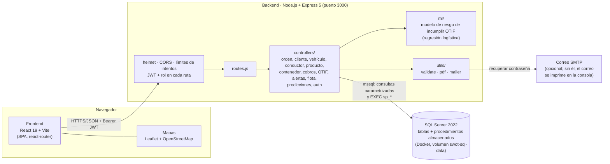
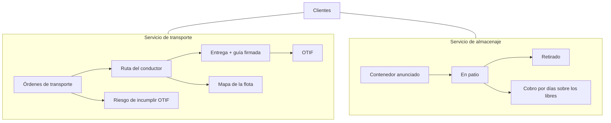
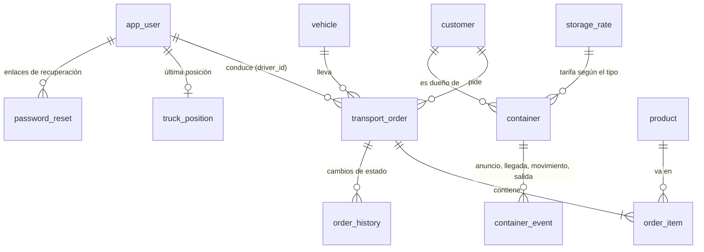

# Arquitectura

SWOT es una aplicación web de tres capas: un frontend React que habla por HTTP/JSON con una API Express, que a su vez usa SQL Server. No hay servicios intermedios ni colas: es un monolito simple, pensado para entenderse de una sola lectura.

## Vista general



## Capas y responsabilidades

| Capa | Dónde | Qué hace | Qué no hace |
|---|---|---|---|
| Presentación | `frontend/src/pages`, `components` | Pantallas por rol, formularios, gráficos y mapas. Muestra en español los códigos en inglés de la API (`utils/format.js`) | No decide permisos de verdad: solo oculta lo que el rol no puede usar |
| Acceso a la API | `frontend/src/services/api.js` | Un cliente `axios` con el token; si la sesión venció o la cuenta se desactivó, vuelve al login | |
| Seguridad | `backend/src/middlewares` | `auth` valida el JWT y relee rol, estado activo y fecha de cambio de contraseña desde la base; `role` restringe cada ruta; `limiters` frena intentos de login y recuperación | |
| Rutas | `backend/src/routes.js` | Tabla única de "qué ruta, qué controlador, qué roles" | |
| Lógica | `backend/src/controllers` | Valida la entrada, aplica las reglas de negocio y arma la respuesta | No arma SQL con texto del usuario |
| Datos | `database/` | Esquema, procedimientos almacenados (los cambios de estado son transacciones) y scripts de migración | |
| IA | `backend/ml` | Genera datos simulados, entrena y predice el riesgo de incumplir el OTIF (ver [modelo-ia.md](modelo-ia.md)) | |

## Los dos servicios

La empresa vende dos servicios que comparten clientes y usuarios:



## Modelo de datos



- **Estados** (texto en inglés con `CHECK` en la base): OT `Created → Scheduled → InTransit → Delivered | Failed`; contenedor `Expected → InYard → Departed`.
- **Peso de la OT**: se calcula con los productos; solo se escribe a mano si algún producto no tiene peso.
- **Cobro de almacenaje**: no se guarda, se calcula al consultar (`días en patio − días libres del tipo`, por la tarifa diaria del tipo). Así un cambio de tarifa se aplica a todo y no hay cifras desactualizadas.
- **Posición del camión**: una sola fila por conductor (la última), que se borra al terminar la ruta.

## Decisiones importantes

- **Procedimientos almacenados para lo que cambia varias tablas** (crear OT con sus productos, cambiar estado + historial, registrar un evento del contenedor, restablecer contraseña): así la operación es atómica aunque la API falle a medias.
- **Roles leídos de la base en cada petición**, no del token: desactivar a alguien o cambiar su contraseña surte efecto al instante. El token (8 h) solo dice quién es.
- **Recuperar contraseña sin revelar cuentas**: la respuesta es la misma exista o no el correo; el enlace es de un solo uso, vence a los 30 minutos y se guarda solo su hash.
- **Cobro y alertas comparten la misma regla** (`src/config/storage.js`): un contenedor está "pasado de plazo" exactamente cuando tiene días a cobrar.
- **IA sin librerías**: con 6 variables basta una regresión logística en JavaScript puro; el modelo entrenado es un JSON de 6 pesos que se versiona en Git.
- **Sin ORM**: el proyecto es pequeño y el SQL explícito es más fácil de revisar en cuanto a inyección.

## Estructura de carpetas

```
swot-mvp/
├── README.md                    Visión general y puesta en marcha
├── docs/
│   ├── arquitectura.md         Este documento
│   ├── modelo-ia.md            El modelo de riesgo de incumplir OTIF
│   └── screenshots/            Capturas usadas en el README
├── backend/
│   ├── server.js               Arranque: helmet, CORS, límites generales, /api
│   ├── src/
│   │   ├── routes.js           Ruta → controlador → roles permitidos
│   │   ├── config/             db.js (conexión), storage.js (regla de días libres y cobro)
│   │   ├── middlewares/        auth, role, limiters
│   │   ├── controllers/        Un archivo por tema (order, container, billing, otif, ...)
│   │   └── utils/              validate (RUT, patente, ISO 6346), pdf, mailer, catalog
│   ├── ml/                     model.js, train.js y model.json (el modelo entrenado)
│   ├── scripts/                run_sql.js (ejecuta .sql), backup.js
│   └── tests/api.test.js       Pruebas automáticas de punta a punta
├── frontend/
│   └── src/
│       ├── pages/              Una pantalla por ruta (Orders, Containers, Billing, Otif, ...)
│       ├── components/         Modales, gráficos, mapas, barra superior
│       ├── hooks/              useTruckTracking (ubicación del conductor)
│       ├── services/api.js     Cliente HTTP
│       └── utils/format.js     Etiquetas en español, RUT, dinero, fechas
├── database/
│   ├── init.sql                Esquema completo + datos de prueba
│   ├── procedures.sql          Procedimientos almacenados
│   ├── upgrades/               Migraciones para una base que ya existe
│   └── demo/                   Datos de demostración (OTIF)
└── postman/                    Colección con 133 peticiones
```

## Flujos que conviene conocer

**Entrega de una OT.** El despachador crea la OT (`sp_create_order`) → la programa con vehículo y conductor (`sp_schedule_order` valida capacidad y revisión técnica) → el conductor la inicia (`InTransit`, su teléfono empieza a informar la posición) → registra la entrega con RUT y foto de la guía (`sp_change_order_status`, que además guarda el historial y borra la posición). Con esas fechas se calcula el OTIF.

**Contenedor.** El patio lo anuncia (`sp_create_container`) → registra llegada, movimientos y salida (`sp_register_container_event`). Desde la llegada corren los días libres del tipo; pasados esos días se cobra la tarifa diaria hasta la salida.

**Recuperar contraseña.** `forgot-password` genera un código aleatorio, guarda su hash y envía el enlace → `reset-password` valida el hash, la vigencia y que no se haya usado, cambia la contraseña (`sp_reset_password`) y anota la fecha, con lo que los tokens emitidos antes quedan inválidos.
